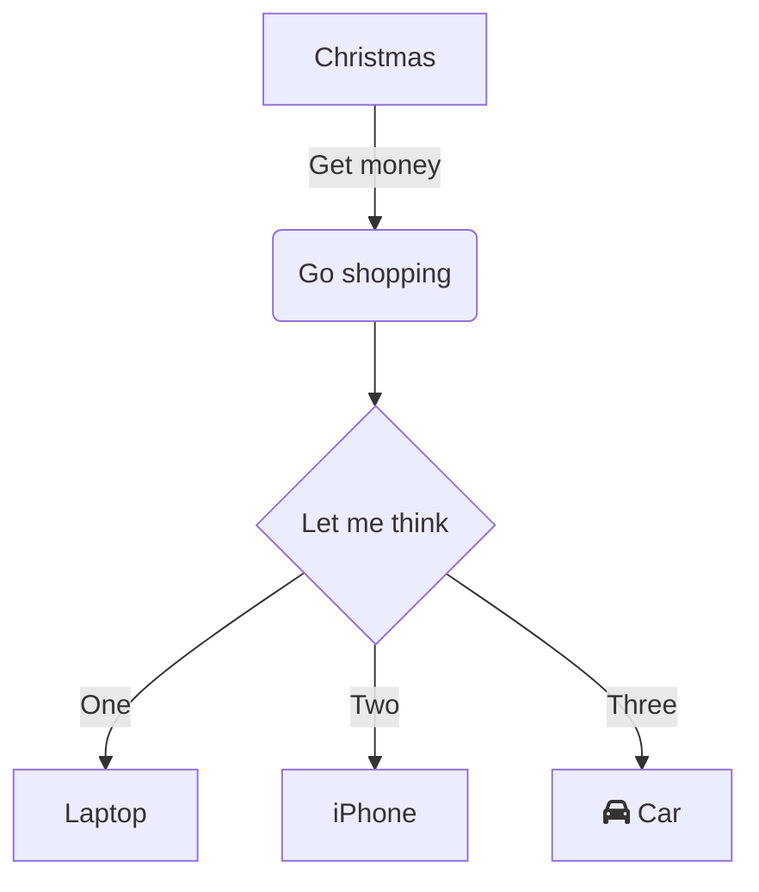

# canvas 基础

## HTMLCanvasElement

```js
<canvas id="tutorial" width="300" height="150">
你的浏览器不支持canvas,请升级你的浏览器
</canvas>
```
属性：
1. HTMLCanvasElement.width // 默认值300
2. HTMLCanvasElement.height // 默认值150
   
方法：
1. HTMLCanvasElement.getContext()
2. HTMLCanvasElement.toDataURL()
3. HTMLCanvasElement.toBlob()


## CanvasRenderingContext2D

```js
const canvas = document.getElementById('canvas')
const ctx = canvas.getContext('2d')

// style
ctx.fillStyle = color
ctx.strokeStyle = color

ctx.lineWidth = value // (1.0)
ctx.lineCap = type // butt, round, square
ctx.lineJoin = type // round, bevel, miter
ctx.lineDashOffset = value

ctx.globalAlpha = transparencyValue // 0 ~ 1.0 (1.0)  alpha 或透明值
ctx.globalCompositeOperation = type // source-over(default), source-in, source-out, source-atop, destination-over, destination-in, destination-out, destination-atop, lighter, darken, lighten, xor, copy

ctx.setLineDash([20, 5]);  // [实线长度, 间隙长度]
​ctx.getLineDash()

ctx.createLinearGradient(x0,y0,x1,y1) // 创建线性的渐变对象
ctx.createRadialGradient(x0,y0,r0,x1,y1,r1) // 创建放射状/圆形渐变对象
grd.addColorStop(stop,color)
ctx.createPattern(image,"repeat|repeat-x|repeat-y|no-repeat") // 在指定的方向内重复指定的元素

// 路径
ctx.beginPath() // 起始一条路径
ctx.moveTo(x, y) // 把路径移动到画布中的指定点，不创建线条
ctx.lineTo(x,y) // 
ctx.closePath()
ctx.stroke() // 绘制已定义的路径
ctx.fill()
ctx.isPointInPath(x,y) // 指定的点是否位于当前路径中

// 圆弧
ctx.arc(x, y, r, startAngle, endAngle, anticlockwise)
ctx.arcTo(x1, y1, x2, y2, radius)
// 矩形
ctx.rect(x, y, width, height) // 创建矩形
ctx.fillRect(x, y, width, height) // 绘制"被填充"的矩形
ctx.strokeRect(x, y, width, height) // 绘制矩形（无填充）
ctx.clearRect(x, y, widh, height) // 在给定的矩形内清除指定的像素

// 文本
ctx.font = value // (10px sans-serif)
ctx.textAlign = value // start, end, left, right, center (start)
ctx.textBaseline = value // top, hanging, middle, alphabetic, ideographic, bottom (alphabetic)
ctx.direction = value // ltr, rtl, inherit (inherit)

ctx.fillText(text, x, y [, maxWidth])
ctx.strokeText(text, x, y [, maxWidth])
ctx.measureText(text)

// 图像
ctx.drawImage(img, x, y)
ctx.drawImage(img, x, y, width, height)
ctx.drawImage(img, sx, sy, sWidth, sHeight, dx, dy, dWidth, dHeight)

ctx.createImageData(width,height)
ctx.createImageData(imageData)
ctx.getImageData(x,y,width,height)
ctx.putImageData(imgData,x,y,dirtyX,dirtyY,dirtyWidth,dirtyHeight)

// 转换
ctx.translate(x, y)
ctx.rotate(angle)
ctx.scale(x, y)
ctx.transform(a, b, c, d, e, f)

// 其它
ctx.clip() // 从原始画布剪切任意形状和尺寸的区域
ctx.save()
ctx.restore()

canvas.toDataURL(type, encoderOptions);

```

## Path2D

## ImageData


## canvas 常用

### 清空画布
1. 重置canvas高度或宽度（canvas重置）
   canvas.width = canvas.width
   canvas.height = canvas.height

2. clearRect
   context.save();
   context.setTransform(1, 0, 0, 1, 0, 0);
   ctx.clearRect(0,0,canvas.width,canvas.height)
   context.restore();

3. 用特定颜色填充画布
   cxt.fillStyle="#000000"
   ctx.fillRect(x, y, width, height)

### 高清屏缩放

```js
function setupCanvas(canvas) {
    // Get the device pixel ratio, falling back to 1.
    var dpr = window.devicePixelRatio || 1;
    // Get the size of the canvas in CSS pixels.
    var rect = canvas.getBoundingClientRect();
    // Give the canvas pixel dimensions of their CSS
    // size * the device pixel ratio.
    canvas.width = rect.width * dpr;
    canvas.height = rect.height * dpr;
    var ctx = canvas.getContext('2d');
    // Scale all drawing operations by the dpr, so you
    // don't have to worry about the difference.
    ctx.scale(dpr, dpr);
    return ctx;
}

canvas.style.width = canvas.width + 'px';
canvas.style.height = canvas.height + 'px';
canvas.width = canvas.width * ratio;
canvas.height = canvas.height * ratio;

```


# canvas 实践

## canvas 优化
1. 将渲染阶段的开销转嫁到计算阶段之上。
2. 使用多个分层的 Canvas 绘制复杂场景。
3. 不要频繁设置绘图上下文的 font 属性。
4. 不在动画中使用 putImageData 方法。
5. 通过计算和判断，避免无谓的绘制操作。
6. 将固定的内容预先绘制在离屏 Canvas 上以提高性能。
7. 使用 Worker 和拆分任务的方法避免复杂算法阻塞动画运行。

## example

> 例一 太阳系动画
```js
;(function animate(t) {
    const n = Math.round(t*60/1000)

    const sunX = 200
    const sunY = 200
    const sunR = 150
    ctx.drawImage(sun, 0, 0, 400, 400)
    ctx.strokeStyle = '#fff'
    ctx.beginPath()
    ctx.arc(sunX, sunY, sunR, 0, 2*Math.PI)
    ctx.stroke()

    const earthX=sunX+sunR*Math.cos(n*Math.PI/1800)
    const earthY=sunY+sunR*Math.sin(n*Math.PI/1800)
    const earthR=50
    ctx.drawImage(earth, earthX-15, earthY-15)
    ctx.strokeStyle = '#fff'
    ctx.beginPath()
    ctx.arc(earthX, earthY, earthR, 0, 2*Math.PI)
    ctx.stroke()

    const moonX = earthX+earthR*Math.cos(n*Math.PI/180)
    const moonY = earthY+earthR*Math.sin(n*Math.PI/180)
    ctx.drawImage(moon, moonX-3, moonY-3)

    window.requestAnimationFrame(animate)
})()

```

> 例2 移动鼠标
```js
function drawMouse() {
    const dom = document.getElementById('mouse')
    const ctx = dom.getContext('2d')
    const m = {
        x: dom.width / 2,
        y: dom.height / 2
    }
    const a = [] // 
    const ar = 150
    const theta = 2*Math.PI/180
    console.log(theta)
    dom.addEventListener('mousemove', function(e) {
        m.x = e.offsetX
        m.y = e.offsetY
    })
    function gc() {
        var s = '0123456789ABCDEF'
        var r = '#'
        for (let i=0; i<6; i++) {
            r+=s[Math.floor(Math.random()*16)]
        }
        return r
    }
    function obc(r, r0, r1) {
        this.r = r
        this.r0 = r0
        this.r1 = r1
        this.color = gc()
        this.dr = function() {
            ctx.beginPath()
            ctx.strokeStyle = this.color
            ctx.arc(m.x, m.y, this.r, this.r0, this.r1)
            ctx.stroke()
            this.r0 += theta
            this.r1 += theta
        }
    }
    function obl(r, r0, r1) {
        this.r = r
        this.r0 = r0
        this.x = m.x
        this.y = m.y
        this.color = gc()
        this.dr = function() {
            ctx.beginPath()
            ctx.strokeStyle = this.color

            ctx.moveTo(this.x, this.y)
            this.r0 += theta
            this.r1 += theta
            this.x = m.x+this.r*Math.cos(this.r0) 
            this.y = m.y+this.r*Math.sin(this.r0)

            ctx.lineTo(this.x, this.y)
            ctx.stroke()
            ctx.closePath()

        }
    }
    function render() {
        ctx.clearRect(0,0,dom.width, dom.height)
        ctx.lineWidth = 4
        // ctx.globalAlpha = 0.5
        for (let i=0; i<30; i++) {
            let r0 = 2*Math.PI*Math.random()
            let r1 = r0 + 2*Math.PI/10
            a[i] = new obl(Math.random()*ar, r0, r1)
        }
        a.forEach(function(item) {
            item.dr()
        })
        
    }
    render();
    (function animate() {
        // ctx.clearRect(0,0,dom.width, dom.height)
        ctx.fillStyle = "rgba(0,0,0,0.05)"
        ctx.strokeStyle = "#000000"
        ctx.beginPath()
        ctx.rect(0,0, dom.width, dom.height)
        ctx.stroke()
        ctx.fill()

        a.forEach(function(item) {
            item.dr()
        })
        window.requestAnimationFrame(animate)
    })()
}
```

# canvas lib


## zrender

$F=2x$



```js
function drawRect() {
    let dom = document.getElementById('rect')
    console.log(dom)
    let zr = zrender.init(dom, {
        renderer:'canvas',
        width:'500',            //画布宽度
        height:'300'            //画布高度
    })

    let rect = new zrender.Rect({
        // position:[0,0],  //平移距离
        style:{
            fill:'white',    //填充颜色
            stroke:'black',    //描边颜色

            // text:'图形文字',    //文字
            // textFill:'#333',   //文字颜色
            // fontSize:12,       //文字大小
            // transformText:true  //字体跟随变换效果
            text:'图形文字',             //文字
            textFill:'#333',             //文字颜色
            fontSize:48,                 //文字大小
            // fontFamily:'',            //字体
            fontStyle:'normal',          //字形
            fontWeight:'normal',         //加粗
            textStroke:'black',         //文字描边
            textWidth:10,                 //字体线宽
            textHeight:48,               //字体高度
            textLineWidth:6,             //字体描边线宽
            textLineHeight:48,           //字体行高
            textPosition:'bottom',       //字体位置
            textPadding:[0,0,0,0],       //文字内边距
            transformText:true           //字体跟随变换效果
        },
        shape:{
            x:0,             //x,y代表坐标
            y:0,
            width:200,
            height:100,
            r:[3]            //圆角
        },
        // z:1                  //层次，大的会覆盖小的
    })
    // zr.on('click', function(e) {
    //     console.log(e)
    //     console.log('点击了矩形')
    // })
    zr.add(rect)
    let text = new zrender.Text({
        style: {
            text: '这是一段' + '\n' + '文字',
            textBackgroundColor:'red',     //包围盒背景
            textBorderColor:'blue',         //包围盒描边颜色
            textBorderWidth:2,             //包围盒描边线宽
            textPadding:[10,20,10,20]      //文字内边距，同css Padding
        }
    })
    text.on('click', function() {
        console.log('点击了text')
    })
    // zr.add(text)
    // console.log(text.getBoundingRect())

    // rect.animate('shape',true)
    // .when(1000, {x:100})
    // .when(2000,{x:0})
    // .when(3000,{y:100})
    // .when(4000,{y:0})
    // .start();

    // rect.animateTo({
    //     shape: {
    //         width: 300
    //     },
    //     style: {
    //         fill: 'blue'
    //     },
    //     position:[10,10]
    // }, 1000, 1000, 'cubicOut', function () {    
    //     console.log('done')
    // })
    // setTimeout(function() {
    //     rect.attr({
    //     style:{
    //         fill:'yellow'
    //     },
    //     // shape:{
    //     //     width:300,
    //     //     height:200
    //     // }
    // })
    // }, 2000)
}

```


