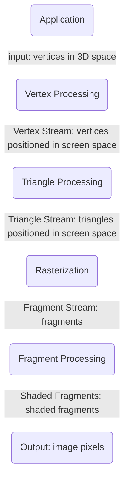

# graphacs


## base
- Linear algebra，calculus，statistics
- Optics，Mechanics
- Signal processing
- Numerical analysis
- aesthetic

## Vector 向量
1. 定义
- Usually written as $\vec{a}$ or $\mathbf{a}$
- Or using start and end points $\overrightarrow{AB}=B-A$
- Direction and length
- No absolute starting position

2. 属性
- lenght of a vector written as $||\vec{a}||$
- Unit vector $\hat{a}=\vec{a}/||\vec{a}||$
- $\vec{a}+\vec{b}=\vec{c}$ 向量的加法，
$$
A=\begin{pmatrix} x \\ y \end{pmatrix},\quad
A^T=\begin{pmatrix} x & y \end{pmatrix},\quad
||A||=\sqrt{x^2+y^2}
$$
3. Dot product $\vec{a}\cdot\vec{b}$
- 
$$
\vec{a}\cdot\vec{b}=||\vec{a}\vec{b}||cos\theta, \quad
cos\theta= \frac{\vec{a}\cdot\vec{b}}{||\vec{a}\vec{b}||}
$$
- 单位向量 $cos\theta=\vec{a}\cdot\vec{b}$
- 属性 交换律，结合律
  $$
  \vec{a}\cdot\vec{b}=\vec{b}\cdot\vec{a},\quad
  \vec{a}\cdot(\vec{b}+\vec{c})=\vec{a}\vec{b}+\vec{a}\vec{c},\quad
  (k\vec{a})\cdot\vec{b}=\vec{a}(k\vec{b})=k(\vec{a}\cdot\vec{b})

  $$
- In 3D
  $$
  \vec{a}\cdot\vec{b}=
  \begin{pmatrix} x_a \\ y_a \\ z_a \end{pmatrix}\cdot
  \begin{pmatrix} x_b \\ y_b \\ z_b \end{pmatrix}
  =x_ax_b+y_ay_b+z_az_b
  $$
- 投影
  $$
  \vec{b}_\perp=k\hat{a},\quad
  k=||\vec{b_\perp}||=||\vec{b}||cos\theta
  $$
- 应用 dot product > or < 0
  - Measure how close two direcrions are
  - Decompose a vector
  - Detemine forward / backward
   
4. cross product
$$
\vec{a}\times\vec{b}=-\vec{b}\times\vec{a}, \quad
||\vec{a}\times\vec{b}||=||\vec{a}|| ||\vec{b}||sin\varphi
$$
- Cross produc is orthogonal to two initial vectoes
- Direction determined by right-hand rule
- Useful in constructing coordinate systems
  $$
  \vec{a}\times\vec{b}=-\vec{b}\times\vec{a},\quad
  \vec{a}\times\vec{a}=0,\quad
  \vec{a}\times(k\vec{b})=(k\vec{a})\times\vec{b}=k(\vec{a}\times\vec{b})
  $$
  $$

  $$


## Orthonormal Coordinate Frames
$$||\vec{u}||=||\vec{v}||=||\vec{w}||$$
$$\vec{u}\cdot\vec{v}=\vec{v}\cdot\vec{w}=\vec{u}\cdot\vec{w}$$
$$\vec{w}=\vec{u}\times\vec{v} \quad(right-hand)$$ 
$$\vec{p}=(\vec{p}\cdot\vec{u})\vec{u}+(\vec{p}\cdot\vec{v})\vec{v}+(\vec{p}\cdot\vec{w})\vec{u}$$


## Matrix


## transformation

> 2D

$2D point = (x,y,1)^T$

$2D vector = (x,y,0)^T$

仿射变换
Affline map = linear map + translation
$$
\begin{pmatrix} x' \\ y' \end{pmatrix}=
\begin{pmatrix} a&b \\ c&d \end{pmatrix}\cdot
\begin{pmatrix} x \\ y \end{pmatrix}+
\begin{pmatrix} t_x \\ t_y \end{pmatrix}
$$
齐次变换
homogenous coordinates 
$$
\begin{pmatrix} x' \\ y' \\ 1 \end{pmatrix}=
\begin{pmatrix} a&b&t_x \\ c&d&t_y \\ 0&0&1 \end{pmatrix}\cdot
\begin{pmatrix} x \\ y \\ 1 \end{pmatrix}
$$

1. 平移 Translation
$$
T(t_x, t_y)=
\begin{pmatrix} 1&0&t_x \\ 0&1&t_y \\ 0&0&1 \end{pmatrix}
$$

2. 缩放 Scale
$$
S(s_x, s_y)=
\begin{pmatrix} s_x&0&0 \\ 0&s_y&0 \\ 0&0&1 \end{pmatrix}
$$

3. 旋转 Rotation
$$
R(\alpha)=
\begin{pmatrix} cos\alpha&-sin\alpha&0 \\ sin\alpha&cos\alpha&0 \\ 0&0&1 \end{pmatrix}
$$

4. 逆变换 inverse transform
- not commutatice 
- applied right to left


5. 组合 composite transform
$$
A_n(...A_2(A_1(x)))=A_n...A_2 \cdot A_1 \cdot
\begin{pmatrix} x \\ y\\ 1 \end{pmatrix}
$$

6. Decomposing composite transform


> 3D

$3D point = (x,y,z,1)^T$

$3D vector = (x,y,z,0)^T$

use 4x4 matrices for affine transformations
$$
\begin{pmatrix} x' \\ y' \\ z' \\ 1 \end{pmatrix}=
\begin{pmatrix} a&b&c&t_x \\ d&e&f&t_y \\ g&h&i&t_z \\ 0&0&0&1 \end{pmatrix}\cdot
\begin{pmatrix} x \\ y \\ z \\ 1 \end{pmatrix}
$$

1. 平移 Translation
$$
T(t_x, t_y, t_z)=
\begin{pmatrix} 1&0&0&t_x \\ 0&1&0&t_y \\ 0&0&1&t_z \\ 0&0&0&1 \end{pmatrix}
$$

2. 缩放 Scale
$$
S(s_x, s_y, s_z)=
\begin{pmatrix} s_x&0&0&0 \\ 0&s_y&0&0 \\ 0&0&s_z&0 \\ 0&0&0&1 \end{pmatrix}
$$

3. 旋转 Rotation

$$
R_x(\alpha)=
\begin{pmatrix} 1&0&0&0 \\ 0&cos\alpha&-sin\alpha&0 \\ 0&sin\alpha&cos\alpha&0 \\ 0&0&0&1 \end{pmatrix}
$$

$$
R_y(\alpha)=
\begin{pmatrix} cos\alpha&0&sin\alpha&0 \\ 0&1&0&0 \\ -sin\alpha&0&cos\alpha&0 \\ 0&0&0&1 \end{pmatrix}
$$

$$
R_z(\alpha)=
\begin{pmatrix} cos\alpha&-sin\alpha&0&0 \\ sin\alpha&cos\alpha&0&0 \\ 0&0&1&0 \\ 0&0&0&1 \end{pmatrix}
$$

4. 组合 composite transform
$$R_{xyz}(\alpha, \beta, \gamma)=R_x(\alpha)R_y(\beta)R_z(\gamma)$$
Rotation by angle $\alpha$ around axis n:
$$
R(n,\alpha)=cos(\alpha)I + (1-cos(\alpha))nn^T+sin(\alpha)
\begin{pmatrix} 0&-n_z&n_y \\ n_z&0&-n_x \\ -n_y&n_x&0 \end{pmatrix}
$$

> Viewing(观测) transformation

1. View(视图) / Camera transfromation
Define the camera: The origin, up at Y, look at -Z
- Position $\vec{e}$
- Look-at / gaze direction $\hat{g}$
- Up direction $\hat{t}$
2. M view n math
- Translates e to origin
- Rotates g to -Z
- Rotates t to Y
- Rotates (g x t) To X


3. Projection(投影) transformation

- Orthographic(正交) projection


- Perspective(透视) projection


## Rasterization 光栅化

1. screen
- An array of pixels
- Size of array: resolution
- A typical kind of raster display
2. Raster 
3. Pixel

> Triangles
* Most basic polygon
* Unique properties

> Sampling 采样

Artifacts due to sampling
* Jggies - sampling in space
* Moire - undersampling images
* Wagon wheel effect - sampling in time
* more ...

Frequency Domain 频域

Fourier Transform 傅立叶变换

Filtering(Getting rid of certain frequency contents) 滤波
1. Hight-pass filter
  滤除低频信号（变化缓慢的信号，梯度小），保留高频信号
2. Low-pass filter
  滤除高频信号（变化剧烈的信号，梯度大），保留低频信号

Convolution 卷积
时域卷积等于频域乘积
时域乘积等于频域卷积

Sampling = Repeating Frequency Contents（奈奎斯特采样定律）

Antialiasing 反走样
1. Increase sampling rate
2. Filtering out hight frequencies before sampling
先模糊（低通滤波），再采样

MSAA (MultiSampling Anti-Aliasing) 多重采样抗锯齿
FXAA (Fast Approximate Anti-Aliasing)
TAA (Temporal Anti-Aliasing)

Super resolution / super sampling


Announcements

> visibility / occlusion 可见性/遮挡
* painter's algorithm 从远到近

* Z-buffering 深度缓存
  1. store current min z-value for each sample(pixel)
  2. needs an additonal buffer for depth values
    - frame buffer stores color values
    - depth buffer(z-buffer) stores depth
  3. complexity: O(n) for n triangles

initialize depth buffer to $\infty$
```js
for (each triangle T) {
  for (each sample (x,y,z) in T) {
    if (z < zbuffer[x,y]) {
      framebuffer[x,y] = rgb; // update color
      zbuffer[x,y] = z; // update depth
    } else {

    }
  }
}
```
## shading 着色
- illumination & Shading
- graphics pipeline
> applying a material to an object

### Blinn-Phong reflectance model 布林-冯着色模型：

1. diffuse reflection 漫反射
$$
L_d=k_d(I/r^2)max(0, \vec{n}\cdot\vec{l})
\quad k_d: 漫反射系数 n: 法向量，l：入射向量
$$


2. specular reflection 镜面反射
$$\vec{h}=bisector(\vec{v},\vec{{I}})=\frac{\vec{v}+\vec{{I}}}{|| \vec{v}+\vec{{I}} ||}$$
$$
L_s=k_s(I/r^2)max(0, \vec{n}\cdot\vec{h})^p
\quad k_s: 镜面反射系数 n: 法向量，h：半程向量
$$

3. Ambient Term 环境光照
$$
L_a=k_aI_a
\quad k_a: 环境系数
$$

4. Ambient + Diffuse + Specular = Blinn-Phong reflectance
$$
L=L_a+L_d+L_s=k_aI_a+k_d(I/r^2)max(0, \vec{n}\cdot\vec{l})+k_s(I/r^2)max(0, \vec{n}\cdot\vec{h})^p
$$

### Shading Frequencies着色频率

1. shade each triangle(Flat shading) 逐三角形着色

2. shade each vertex(Gouraud shading) 逐顶点着色
顶点法线
average surrounding face normals
$$
N_v = \frac{\sum_{N_i}}{||\sum_{N_i}||}
$$

3. shade each pixel(Phone shading) 逐像素着色

### (Real-time Rendering) Graphics Pipeline图形管线


1. Shader Programs
* program vertex and fragment processing stages
* describe operation on a single vertex(or fragment)


site: shadertoy(在线shader网站)


2. Highly Complex 3D Scenes in Realtime

3. GPU

### Texture Mapping 纹理映射

Surface are 2D

texture coordinate (u,v)纹理坐标

> barycentric coordinates 重心坐标
$$(x,y)=\alpha A + \beta B + \gamma C$$
$$\alpha + \beta + \gamma = 1$$
$$(x,y)=A/3 + B/3 + C/3$$

插值
$$v=\alpha V_A+\beta V_B+\gamma V_C$$

> texture queries
for each rasterized screen sample(x,y):
(u,v) = evaluate texture coordinate at (x,y);
textcolor = texture.sample(u,v);

* texture magnification
  1. Bilinear interpolation 双线性插值
  2. Bicubic 双三次插值
* Point & Range queries
* Mipmap 
* trilinear interpolation 三线性插值
* 各向异性过滤
* EWA过滤


> applications of texture

Environment Map / Cube Map

Bump/normal mapping 凹凸/法线 贴图

Displacement mapping 位移贴图

3D procedural noise + solid modeling

3D texture and volume rendering

## Geometry


### represent
How to represent geometry in Computer Graphics
1. implicit 隐式 $f(x,y,z)=0$
2. explicit 显式 $f:R^2->R^3;(u,v)->(x,y,z)$


> implicit
1. constructive solid geometry (implicit)
  combine implicit geometry via boolean operations

2. distance functions 距离函数(implicit)
  giving minimum distance from anywhere to object

3. level set methods 水平集

4. factals 分型(implicit)

> explicit
1. point cloud 点云
   list of points(x,y,z)

2. polygon mesh 多边形面


### Curves

> bezier curves

$$
b^n(t)=b^n_0(t)=\sum^n_{j=0}b_jB^n_j(t)
$$

piecewise bezier curves 分段(cubic 4)

C1 continuity C1连续 一阶导数连续

> other types of splines样条
B-splines B-样条

### Surfaces 

bicubic bezier surface patch


### Meshes
> mesh subdivision 细分
1. loop subdivision 卢氏细分
   * split each triangle into four 一分四
   * assign new vertex positons according to weights 加权平均取新顶点
    $3/8*(A+B)+1/8*(C+D)$
   * for old vertices
    $$
2. catmull-clark subdivision(general mesh)

mesh simplification 简化


mesh regularization 


### shadowing mapping


1. render from light: depth image from light source
2. 

problems
1. hard shadows and soft shadows


## Ray Tracing

Rasterization: real-time
Ray tracing: offline

> light rays:
1. kjjjj

### Ray

Ray equation: $r(t)=o+td \quad 0<=t<\infty$

### whitted-style ray tracing

### ray-object intersections

### Axis-Aligned Bounding Boxes(AABBs)

### spatial partitioning 空间划分

Oct-Tree KD-Tree BSP-Tree

KD-Tree:
* split aixs x-,y-,or z-axis
* split position: coordinate of split plane along axis
* children: pointers to child nodes
* no objects are stored to child nodes, leaf nodes store
* list of objects


Bounding volume hierarchy (BVH)


### BRDF

### Render Equation

渲染方程
$$
L_o(p,w_o)=L_e(p,w_o)+\int_{\Omega+}L_i(p,w_i)f_r(p,w_i,w_o)(n\cdot w_i)dw_i
$$

概率密度函数
$$
p(x) >= 0 \quad \int p(x)dx=1 \quad E[x]=\int xp(x)dx
$$


### Monte Carlo integration 蒙特卡洛积分
$$
\int_a^b f(x)dx
$$
$$
\int f(x)dx = \frac{1}{N}\sum_{i=1}^{N}\frac{f(X_i)}{p(X_i)} \quad X_i~p(x)
$$

### Path Tracing 路径追踪

$$
\int f(x)dx = \frac{1}{N}\sum_{i=1}^{N}\frac{f(X_i)}{p(X_i)} \quad X_i~p(x)
$$


$$
L_o(p,w_o)=\int_{\Omega+}L_i(p,w_i)f_r(p,w_i,w_o)(n\cdot w_i)dw_i \approx \frac{1}{N}\sum_{i=1}^{N}\frac{L_i(p,w_i)f_r(p,w_i,w_o)(n \cdot w_i)}{p(w_i)}
$$

```
shade(p,w)

```

$$
L_o(x,w_o)=\int_{\Omega+}L_i(x,w_i)f_r(x,w_i,w_o)cos\theta dw_i = \int_{A}L_i(x,w_i)f_r(x,w_i,w_o)\frac{cos\theta cos\theta^{'}}{||x^{'}-x||^2}dA
$$

## Advanced in Rendering

### Bidirection Path Tracing (BDPT)双向路径追踪


### Metropolis light transport(MLT)

A Markov Chain Monte Carlo application 马尔可夫链 蒙特卡洛应用

### Photon Mapping 光子映射


### Vertex Connection and Merging
A Combination of BDPT and Photon Mapping

### Instant Radiosity (IR)


## Advanced appearance modeling
Participating media 参与介质(散射介质)

### non-surface models
1. 云雾 
2. 头发 hair
3. 毛发 
4. 颗粒 granular
### surface model
1. translucent 可穿透
subsurface scattering 次表面散射  BSSRDF

2. cloth
fibers -> ply -> yarn -> cloth

render as surface 物体表面
render as Participating media 散射介质
render as fibers 单根纤维

### motivation


### procedural appearance 程序化表面


## camera lenses and light fields


## color

### CIE色度图
CIELab
CIELuv
CIExy


Color=R(R)+G(G)+B(B)

### 明度 色调 饱和度


### 色域


### 色温

### 颜色空间


### 色彩管理


## Animation / Simulation

a


opengl / directx / vulcan  shaders
Maya / 3DS MAX / Blender Unity / UE


